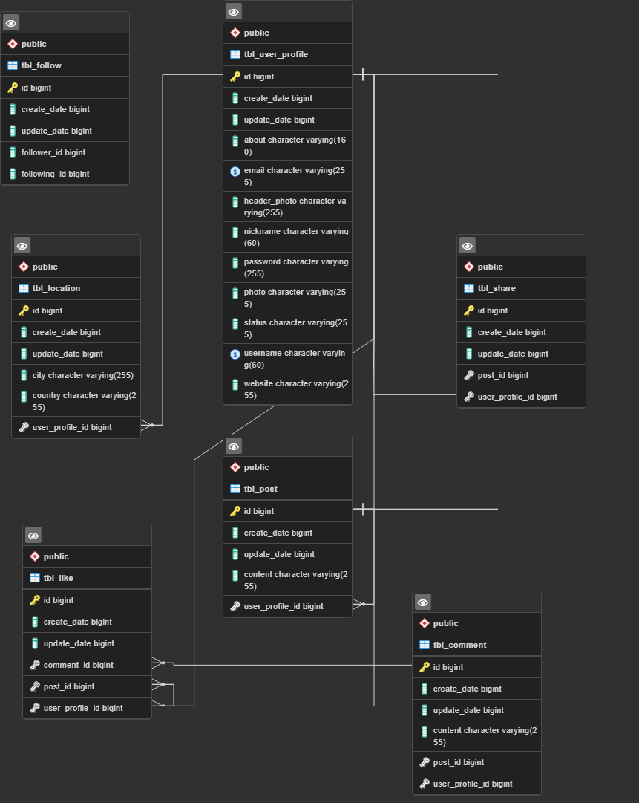

# Pigeon
## Social Media App designed in Spring Boot Monolithic Architecture
Users are expected to register with the application by following certain rules. A token is generated for authenticated users. Users can follow each other securely. They can create, delete, update and list posts. They can like and share posts.
## Used Technologies 
- Java 17
- Spring Boot 3.0.5
- Spring Security 
- Spring Validation
- Lombok
- PostgreSQL
- Swagger
## Database Diagrams

